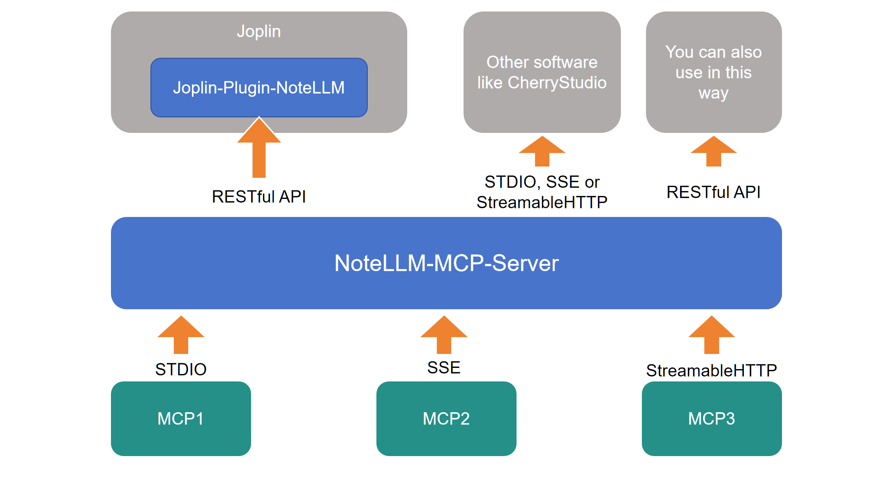

# NoteLLM_MCP_Server

跳转至 [中文说明](docs/README_CN.md)

NoteLLM_MCP_Server is an open-source software designed to provide MCP services via API for the Joplin plugin [NoteLLM](https://github.com/HorseSword/joplin-plugin-notellm).  

It can also serve as a general-purpose MCP service provider through API, or offer standard MCP access via stdio, SSE, or streamableHTTP.




## Features

- **Compatible with Various MCP Tool Integrations**: Supports adding MCP tools through standard JSON files, making tool integration straightforward and intuitive.
- **API-Based MCP Service Mode**: Built on the FastAPI framework, it provides API endpoints for invoking MCP services, enabling efficient and convenient integration and usage.
- **Multiple MCP Service Modes**: By configuring the `mode` parameter, you can enable different running modes, including `stdio`, `sse`, and `streamableHTTP`. These modes can be combined to support various MCP tool integrations and provide a unified MCP service endpoint, making it possible to integrate with tools like CherryStudio as an MCP provider.


## Installation & Usage

### Step 1: Configure your MCP tools

Clone repository to your computer. 

```bash
git clone git@github.com:HorseSword/notellm_mcp_server.git
```


Install packages with uv:

```bash
uv sync
```


Copy **mcp_config.example.json** to **mcp_config.json**, and edit it as standard MCP configure json file, like:

```json
{
    "mcpServers":{
        "stdio-server-npx":{
            "command": "npx",
            "args":["-y","mcp-name"]
        },
        "stdio-server-uvx":{
            "command":"uvx",
            "args":"mcp-name"
        },
        "stdio-server-python":{
            "command": "uv",
            "args": ["run","python_code.py"]
        },
        "sse-server-name":{
            "type": "sse",
            "url": "http://localhost:11111"
        },
        "streamable-http-name":{
            "type": "streamableHttp",
            "url": "http://localhost:22222",
            "headers": {
                "Content-Type": "application/json",
                "Authorization": "Bearer YOUR_TOKEN"
            }
        }
    }
}
```


### Step 2: Run as RESTful API server, for  Joplin-Plugin-NoteLLM 

Start the server:

```
uv run mcp_server.py
```

It will run on http://127.0.0.1:7302 by default. 

You can also add `--host` and `--port` to run as you want.


### Step 3: Change settings of Joplin-Plugin-NoteLLM 

Go to settings of [NoteLLM](https://github.com/HorseSword/joplin-plugin-notellm) >= v0.6.0,

(1) Find "Advanced settings", and fill "URL for MCP Server (Preview)" part.

(2) Change "MCP for LLM (preview)" from "OFF" to "MCP (tool call)" below LLM1 to LLM3. **Reminder: Your model must support "tool call"**.


Congratulations! Your NoteLLM can use MCP tools now.


### Optional Step: Run as normal MCP server

You can also use this server as a normal MCP provider, and all MCPs to it can be user together. Such as:

`uv run mcp_server.py --mode stdio`  for STDIO MCP;

`uv run mcp_server.py --mode sse`  for SSE MCP;

`uv run mcp_server.py --mode http`  for StreamableHTTP MCP.


You can configure it as following:

```json
{
    "mcpServers": {
        "ANYTHING_HERE": {
            "name": "NoteLLM_MCP_Server",
            "type": "sse",
            "description": "local mcp server",
            "isActive": true,
            "tags": [],
            "baseUrl": "http://127.0.0.1:7302/sse"
        }
    }
}
```


## Tech Stack

NoteLLM_MCP_Server is primarily built with the following technologies:

- **FastMCP**: Handles the core logic of the MCP protocol.
- **FastAPI**: Builds a high-performance API server, offering RESTful APIs for MCP service invocation.


## Use Cases

NoteLLM_MCP_Server can be used in various scenarios where MCP service integration and provision are required, such as:

- Providing MCP functionality for the Joplin plugin [NoteLLM](https://github.com/HorseSword/joplin-plugin-notellm).
- Acting as an MCP provider for tools like CherryStudio.
- Deploying locally or in the cloud to offer a unified MCP service interface.
- Remotely invoking and managing MCP services via API endpoints.


## Changelog

Version | Date | Detail
--|--|--
v0.1.0 | 2025-08-03 | Initial implementation of basic features