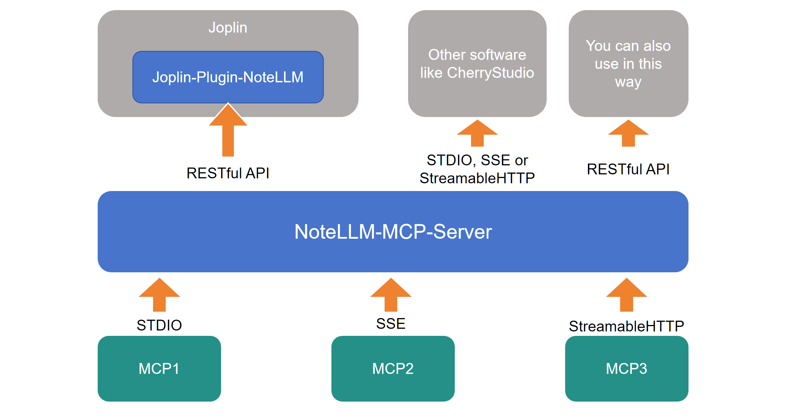

# NoteLLM_MCP_Server

NoteLLM_MCP_Server 是一个开源软件，主要用于以 API 的形式，为 Joplin 插件 [NoteLLM](https://github.com/HorseSword/joplin-plugin-notellm) 提供MCP服务; 或通过 stdio、sse 或 streamableHTTP 的形式提供标准 MCP 接入服务；此外也可以提供通用 API 模式的 MCP 服务。




## 特点

- **兼容各类MCP工具接入**：支持通过标准的JSON文件添加MCP工具，使得工具的集成变得简单直观。
- **提供API调用MCP的服务模式**：基于FastAPI框架，提供API接口以调用MCP服务，使得服务的集成和调用更加高效和便捷。
- **提供多种MCP对外服务模式**：通过设置参数`mode`，可以启用不同的运行模式，包括`stdio`、`sse`和`streamableHTTP`模式。这些模式的组合允许实现多种MCP工具接入，并提供统一的MCP服务出口，支持作为MCP提供方接入如CherryStudio等工具。


## 安装与使用

以支撑 [NoteLLM](https://github.com/HorseSword/joplin-plugin-notellm) 为例。

### 第一步：配置你的 MCP 工具

将仓库克隆到你的电脑上。

```bash
git clone git@github.com:HorseSword/notellm_mcp_server.git
```

使用 uv 安装软件包：

```bash
uv sync
```

将 **mcp_config.example.json** 复制为 **mcp_config.json**，并按照标准 MCP 配置 JSON 文件进行编辑，例如：

```json
{
    "mcpServers":{
        "stdio-server-npx":{
            "command": "npx",
            "args":["-y","mcp-name"]
        },
        "stdio-server-uvx":{
            "command":"uvx",
            "args":"mcp-name"
        },
        "stdio-server-python":{
            "command": "uv",
            "args": ["run","python_code.py"]
        },
        "sse-server-name":{
            "type": "sse",
            "url": "http://localhost:11111"
        },
        "streamable-http-name":{
            "type": "streamableHttp",
            "url": "http://localhost:22222",
            "headers": {
                "Content-Type": "application/json",
                "Authorization": "Bearer YOUR_TOKEN"
            }
        }
    }
}
```


### 第二步：作为 RESTful API 服务器运行，供 Joplin-Plugin-NoteLLM 使用

启动服务器：

```
uv run mcp_server.py
```

默认情况下，它将在 http://127.0.0.1:7302 上运行。

你也可以添加 `--host` 和 `--port` 来按需运行。


### 第三步：更改 Joplin-Plugin-NoteLLM 的设置

进入 [NoteLLM](https://github.com/HorseSword/joplin-plugin-notellm) >= v0.6.0 的设置，

(1) 找到“显示高级选项”，并填写“URL for MCP Server (Preview)”部分。

(2) 将“MCP for LLM (Preview)”从“OFF”更改为 "MCP (tool call)"。**提醒：你的模型必须支持“tool call (工具调用)”**。

恭喜！你的 NoteLLM 现在可以使用 MCP 工具了。


### 可选步骤：作为普通 MCP 服务器运行

你也可以将此服务器用作普通 MCP 提供者，所有 MCP 都可以一起使用。例如：

`uv run mcp_server.py --mode stdio` 用于 STDIO MCP；

`uv run mcp_server.py --mode sse` 用于 SSE MCP；

`uv run mcp_server.py --mode http` 用于可流式传输的 HTTP MCP。

你可以按以下方式进行配置：

```json
{
    "mcpServers": {
        "ANYTHING_HERE": {
            "name": "NoteLLM_MCP_Server",
            "type": "sse",
            "description": "local mcp server",
            "isActive": true,
            "tags": [],
            "baseUrl": "http://127.0.0.1:7302/sse"
        }
    }
}
```


## 技术栈

NoteLLM_MCP_Server 是主要基于以下技术构建的：

- **FastMCP**：用于处理MCP协议的核心逻辑。
- **FastAPI**：用于构建高性能的API服务器，提供 RESTful API 以调用MCP服务。


## 使用场景

NoteLLM_MCP_Server 可以应用于需要集成和提供MCP服务的各种场景，例如：

- 为 Joplin笔记的插件 [NoteLLM](https://github.com/HorseSword/joplin-plugin-notellm) 提供 MCP 功能。
- 作为MCP提供方接入到CherryStudio等工具。
- 在本地或云环境中部署，提供统一的MCP服务接口。
- 通过API接口，实现对MCP服务的远程调用和管理。


## 升级记录

Version | Date | Detail
--|--|--
v0.1.0 | 2025-08-03 | 实现基础功能
